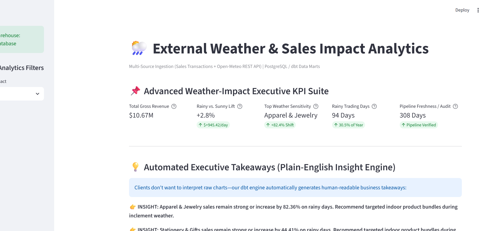
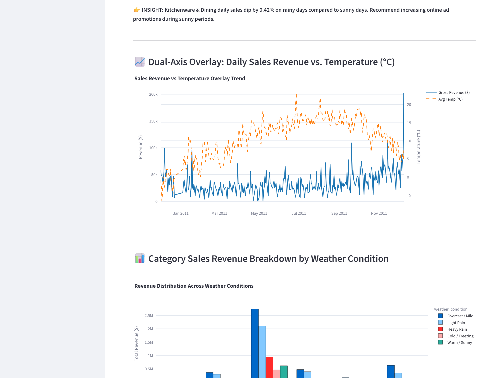
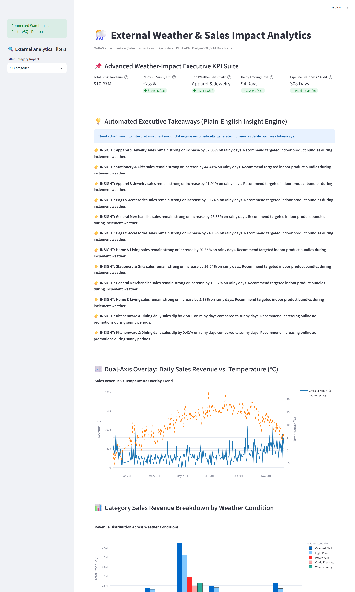
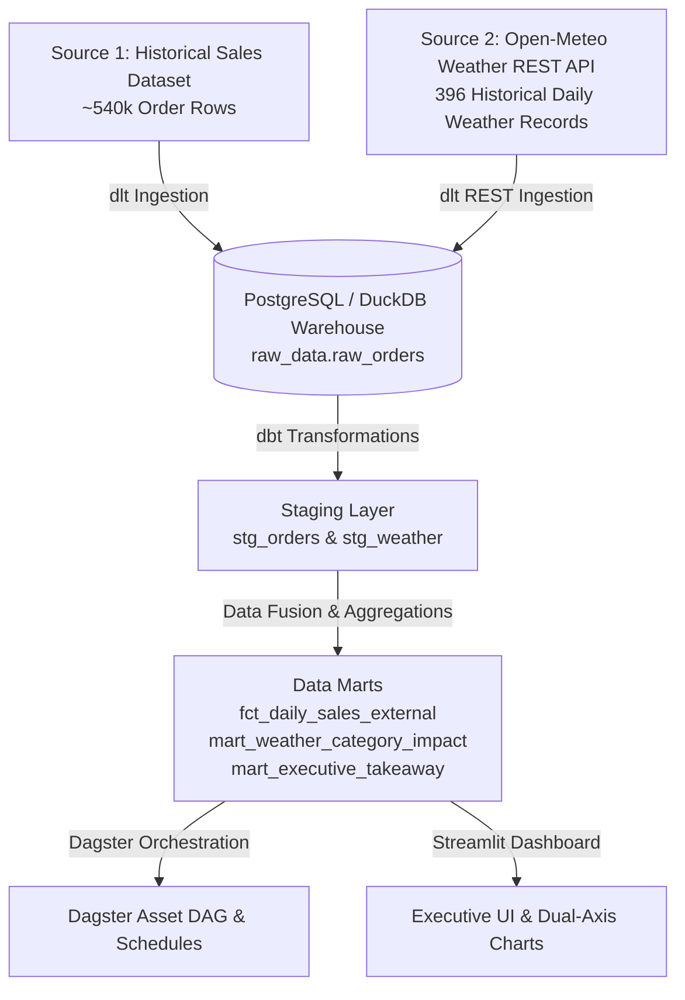

# 🌦️ External Weather & Sales Impact Pipeline (Multi-Source ELT)

[](https://weather-sales-impact.streamlit.app)
[](https://www.getdbt.com/)
[](https://dagster.io/)

> 🚀 **Live Interactive Web App**: [https://weather-sales-impact.streamlit.app](https://weather-sales-impact.streamlit.app)  
> ⏱️ **Note on Free-Tier Hosting**: *Hosted on Streamlit Community Cloud (Free Tier). If the container has been idle, it may take ~45–60 seconds to spin up on first click. For immediate review without waiting, high-resolution preview screenshots are provided below.*

An enterprise-grade multi-source Data Engineering pipeline and executive analytics dashboard built on the **Modern Data Stack** (`dlt`, `PostgreSQL`, `DuckDB`, `dbt`, `Dagster`, `Streamlit`, `Docker`).

Processes historical e-commerce sales transactions (~540,000 order records) merged with live/historical daily weather data from the **Open-Meteo REST API** to determine how weather patterns impact product category sales.

---

## 📸 Executive Dashboard Previews


*Fig 1: Executive KPI suite ($10.67M Revenue, +2.8% Rainy Lift, +82.4% Top Sensitivity) and automated plain-English insight engine.*

<details>
<summary>📊 <b>Click to view Dual-Axis Trend & Category Breakdown Charts</b></summary>
<br>


*Fig 2: Dual-axis daily sales revenue vs. temperature overlay trend & category revenue distribution across weather conditions.*


*Fig 3: Complete scroll view of analytics dashboard.*

</details>

## 🎯 Key Features & Insights

1. **Multi-Source Data Fusion**: Merges raw sales transactions with historical weather API records (Temperature °C, Rainfall mm, Weather Condition).
2. **5-Metric Executive KPI Suite**: Real-time business metrics tracking Total Revenue ($10.67M), Rainy vs. Sunny Sales Lift (+2.8%), Top Weather Sensitivity (+82.4% Shift), Rainy Trading Days, and Pipeline Audit Status.
3. **dbt-postgres Transformation Engine**: Date-level joins, category weather sensitivity metrics, and profit margin analysis.
4. **Automated Plain-English Executive Insight Engine**: Specialized dbt SQL mart generating human-readable business takeaways (e.g. *"Apparel sales surge +82.36% on rainy days — recommend targeted indoor promotional bundles"*).
5. **Interactive Streamlit Dashboard**: Dual-axis Plotly overlay chart (Sales Revenue vs. Temperature), weather condition breakdown bars, and automated Executive Insight Box.
6. **Dagster Orchestration**: Software-defined assets (`@asset`) with weekly automated cron schedules (`0 0 * * 0`).
7. **Multi-Container Docker Setup**: 1-command launch with PostgreSQL database container and application container.

---

## 🏗️ System Architecture



---

## 🛠️ Tech Stack & Licensing ($0.00 Open Source Stack)

* **Ingestion Layer**: `dlt` (Data Load Tool) — 100% Free & Open Source.
* **Storage & Data Warehouse**: `PostgreSQL` & `DuckDB` — 100% Free & Open Source.
* **Transformations & Modeling**: `dbt` (`dbt-postgres` / `dbt-duckdb`) — 100% Free & Open Source.
* **Orchestration**: `Dagster` Software-Defined Assets & Schedules — 100% Free & Open Source.
* **Business Intelligence**: `Streamlit` + `Plotly` web dashboard — 100% Free & Open Source.
* **Containerization**: `Docker` + `Docker Compose` — 100% Free & Open Source.

---

## 🚀 Quickstart Guide

### Option 1: 1-Click Deployment with Docker Compose 🐳
```bash
docker-compose up --build
```
* Live Dashboard: `http://localhost:8502`
* Dagster UI: `http://localhost:3001`

---

### Option 2: Local Execution

#### 1. Install Dependencies
```bash
pip install -r requirements.txt
```

#### 2. Run Pipeline (Multi-Source Extraction + dbt Models)
```bash
python run_pipeline.py
```

#### 3. Launch Interactive Streamlit Dashboard
```bash
streamlit run dashboard/app.py --server.port=8502
```

#### 4. Launch Dagster UI
```bash
dagster dev -f orchestration/repository.py
```
